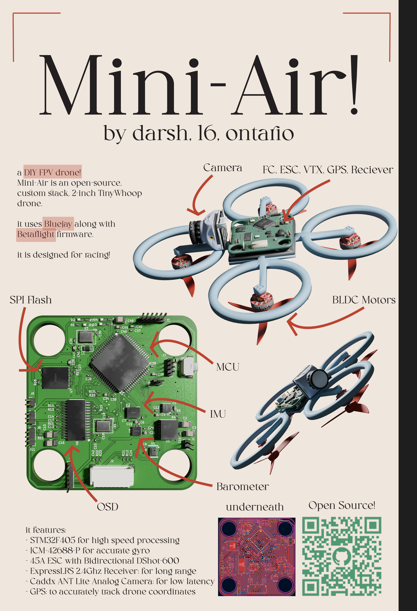
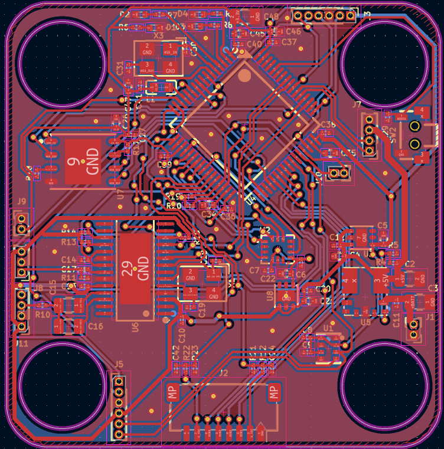
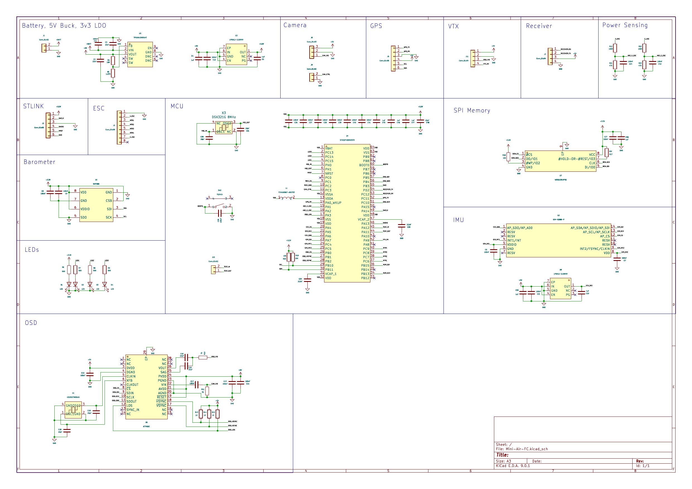
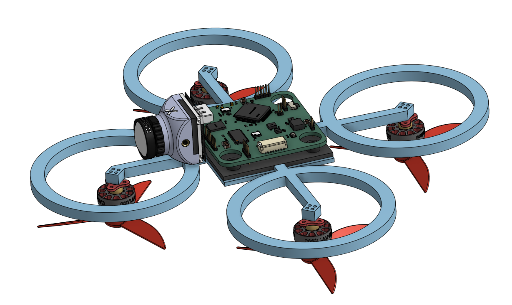

# Mini-Air

Mini-Air is a DIY FPV drone!
it features:
- a custom flight controller supporting Betaflight
- an ESC supporting Bluejay firmware
- ELRS protocol
- an analog camera
- GPS

the custom flight controller has an on-board OSD, IMU, Barometer, and SPI Flash

i made this project to learn how flight controllers and drones work, and because i want to fly a cool fpv drone. the project is optimized to support the features of all the latest fpv software available. all components are analog to reduce latency, and because 480p drone video with osd in general is really aesthetic. with a 2s lipo and a 2-inch propellers, it leans heavily towards speed rather than range or flight time. the vtx, gps, reciever, and esc are all modular, and so can be swapped with different parts if needed. note that the CAD is simplified to just show the rough connection, i am using a bought frame which will allow for screwing in components.

## Poster (Zine)

## Flight Controller Render

## CAD Render

## PCB

## Schematic

## CAD

https://cad.onshape.com/documents/986fb99af7814b930792b89c/w/8ba981f62ca8b18288746bfa/e/dd69b1ef7cccc17bc086fed8?renderMode=0&uiState=6a3726ba5f00d66196d8cb0d

## Assembly:

1. mount ESC and FC to frame and screw in
2. mount propeller to motor and screw in to frame
3. solder camera, vtx, gps, reciever to flight controller
4. mount camera to front of frame, screw in other components to the back
5. flash betaflight firmware by connecting to FC with a STLINK
6. connect battery and radio controller
7. fly!

## BOM

|Item:                                       |Link:                                                                          |Price (CAD):|FIELD4|FIELD5 |Weight (g)|
|--------------------------------------------|-------------------------------------------------------------------------------|------------|------|-------|----------|
|FC PCB                                      |                                                                               |2.83        |      |       |3.9       |
|FC PCBA                                     |                                                                               |236.5       |      |       |          |
|Frame                                       |https://epicfpv.ca/products/hglrc-talon-frame-black                            |45.31       |      |       |46        |
|AneegFpv 45A ESC                            |https://www.aliexpress.com/item/1005009952151526.html                          |32.99       |      |       |13        |
|4x HappyModel EX1103S 1103 7000KV           |https://www.aliexpress.com/item/1005006105578345.html                          |44.59       |      |       |15.2      |
|Propellers                                  |https://www.aliexpress.com/item/1005006966517627.html                          |6.49        |      |       |3.52      |
|CADDX Ant FPV Lite Camera                   |https://www.aliexpress.com/item/1005009014299964.html                          |19.87       |      |       |2         |
|Zeus nano 350mW VTX                         |https://www.aliexpress.com/item/1005008558004179.html                          |35.58       |      |       |2.4       |
|Foxeer Lollipop 3 Micro Omni V4 RHCP Antenna|https://www.aliexpress.com/item/4001191873858.html                             |16.89       |      |       |4.7       |
|HappyModel 2.4G ELRS EP2 Reciever           |https://www.aliexpress.com/item/1005009851731060.html                          |19.18       |      |       |0.41      |
|NewBeeDrone M10Q Micro GPS Module           |https://newbeedrone.com/products/newbeedrone-m10q-micro-gps-module-with-compass|27.80       |      |       |2.61      |
|LiteRadio 2 ELRS                            |https://www.aliexpress.com/item/1005011890268150.html                          |31.18       |      |       |          |
|x4 2S 450mAh 80C lipo battery               |https://www.aliexpress.com/item/1005006138925891.html                          |37.99       |      |       |30        |
|                                            |                                                                               |            |      |       |          |
|                                            |Total USD                                                                      |401.18      |      |Weight:|123.74    |
